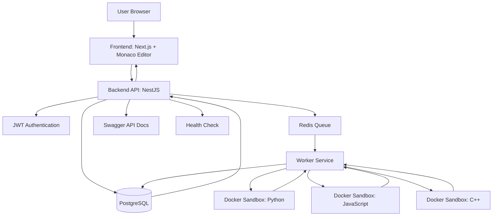

# CodeRunner

Secure code execution platform with Docker sandbox isolation.

## Features

- JWT Authentication
- User registration and login
- Code execution history
- Run details page
- Docker sandbox isolation
- Redis queue processing
- PostgreSQL storage
- Swagger API documentation
- Health monitoring endpoint
- Dark / Light theme
- Multiple programming languages

## Supported Languages

- Python 3
- JavaScript (Node.js)
- C++17

## Architecture

Frontend (Next.js)
↓
Backend API (NestJS)
↓
Redis Queue
↓
Worker Service
↓
Docker Sandbox
↓
Execution Result

## Architecture Diagram



## Screenshots

### Dashboard


### Profile


### Run Details


### Swagger API


## Technology Stack

### Frontend

- Next.js
- TypeScript
- TailwindCSS
- Monaco Editor

### Backend

- NestJS
- Prisma ORM
- PostgreSQL
- Redis
- JWT Authentication

### Infrastructure

- Docker
- Docker Compose

## Installation

### Clone repository

```bash
git clone <repository-url>
cd coderunner
```

### Start infrastructure

```bash
docker compose up -d
```

### Backend

```bash
cd apps/backend

npm install
npm run start:dev
```

### Worker

```bash
cd apps/worker

npm install
npm run start:dev
```

### Frontend

```bash
cd apps/frontend

npm install
npm run dev
```

## API Documentation

Swagger:

```text
http://localhost:3000/api/docs
```

## Health Check

```text
http://localhost:3000/health
```

## Author

Sergiy Zakrevskiy

Bachelor Thesis Project
Software Engineering
